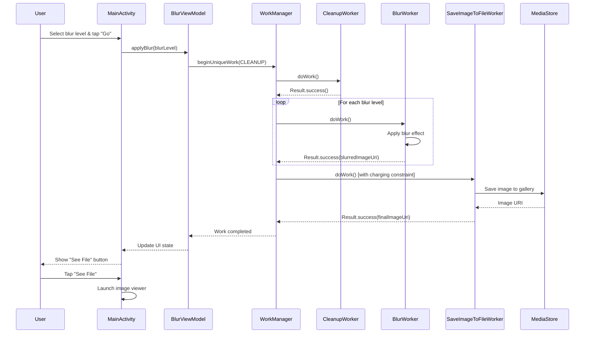
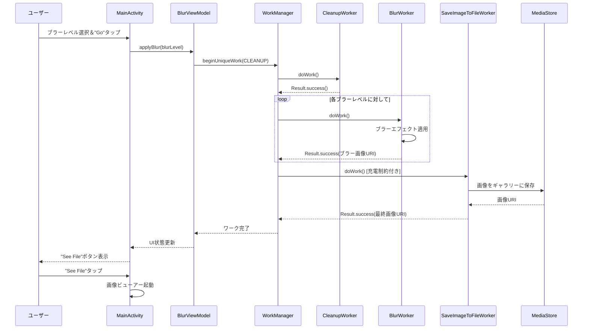

# WorkManager Demo / WorkManagerデモ

## English

### Overview
This Android application demonstrates the usage of WorkManager API for background task processing. The app applies blur effects to images using a chain of background workers, showcasing WorkManager's capabilities for handling complex, deferrable tasks.

### Features
- **Image Blur Processing**: Apply blur effects to images with three intensity levels
- **Background Task Management**: Uses WorkManager for reliable background processing
- **Chained Work Requests**: Demonstrates sequential work execution
- **Work Constraints**: Implements device charging requirements for save operations
- **Progress Monitoring**: Real-time tracking of work progress
- **Work Cancellation**: Ability to cancel ongoing work operations
- **Modern UI**: Built with Jetpack Compose

### Technical Stack
- **Language**: Kotlin
- **UI Framework**: Jetpack Compose
- **Background Processing**: WorkManager
- **Image Processing**: RenderScript (Blur effects)
- **Architecture**: MVVM with ViewModel
- **Min SDK**: 24
- **Target SDK**: 28
- **Compile SDK**: 35

### Project Structure
```
app/src/main/java/com/example/workmanagerdemo/
├── MainActivity.kt                    # Main UI activity with Compose
├── BlurViewModel.kt                   # ViewModel managing work states
├── contants/
│   └── Constants.kt                   # App-wide constants
├── ui/theme/                          # Compose UI theming
└── workers/
    ├── BlurWorker.kt                  # Applies blur effect to images
    ├── CleanupWorker.kt               # Cleans temporary files
    ├── SaveImageToFileWorker.kt       # Saves processed images to gallery
    └── WorkerUtils.kt                 # Utility functions for workers
```

### Work Chain Flow
1. **CleanupWorker**: Removes temporary files from previous operations
2. **BlurWorker(s)**: Applies blur effect (repeated based on selected intensity)
3. **SaveImageToFileWorker**: Saves the final image to device gallery

### Key Components

#### BlurViewModel
- Manages work requests and UI state
- Monitors work progress using StateFlow
- Handles work cancellation
- Provides factory for dependency injection

#### Workers
- **BlurWorker**: Core image processing worker that applies blur effects
- **CleanupWorker**: Maintenance worker for file cleanup
- **SaveImageToFileWorker**: Final step worker with charging constraints

#### UI States
- `INITIAL_STATE`: Ready to start processing
- `IN_PROGRESS`: Work is currently running
- `FINISHED`: Work completed successfully

### Setup and Installation
1. Clone the repository
2. Open in Android Studio
3. Sync Gradle dependencies
4. Run on Android device/emulator (API 24+)

### Usage
1. Launch the app
2. Select blur intensity level (1-3)
3. Tap "Go" to start processing
4. Monitor progress with the progress indicator
5. Use "Cancel Work" to stop ongoing operations
6. Tap "See File" to view the processed image

### Permissions
- **POST_NOTIFICATIONS**: For work progress notifications
- **Storage Access**: For saving processed images to gallery

---

## 日本語

### 概要
このAndroidアプリケーションは、バックグラウンドタスク処理のためのWorkManager APIの使用方法を実演します。ワーカーのチェーンを使用して画像にブラーエフェクトを適用し、複雑で延期可能なタスクを処理するWorkManagerの機能を紹介しています。

### 機能
- **画像ブラー処理**: 3段階の強度レベルで画像にブラーエフェクトを適用
- **バックグラウンドタスク管理**: 信頼性の高いバックグラウンド処理にWorkManagerを使用
- **チェーン化されたワークリクエスト**: 順次ワーク実行のデモンストレーション
- **ワーク制約**: 保存操作にデバイス充電要件を実装
- **進行状況監視**: ワーク進行状況のリアルタイム追跡
- **ワークキャンセル**: 進行中のワーク操作をキャンセルする機能
- **モダンUI**: Jetpack Composeで構築

### 技術スタック
- **言語**: Kotlin
- **UIフレームワーク**: Jetpack Compose
- **バックグラウンド処理**: WorkManager
- **画像処理**: RenderScript（ブラーエフェクト）
- **アーキテクチャ**: ViewModelを使用したMVVM
- **最小SDK**: 24
- **ターゲットSDK**: 28
- **コンパイルSDK**: 35

### プロジェクト構造
```
app/src/main/java/com/example/workmanagerdemo/
├── MainActivity.kt                    # ComposeによるメインUIアクティビティ
├── BlurViewModel.kt                   # ワーク状態を管理するViewModel
├── contants/
│   └── Constants.kt                   # アプリ全体の定数
├── ui/theme/                          # Compose UIテーマ設定
└── workers/
    ├── BlurWorker.kt                  # 画像にブラーエフェクトを適用
    ├── CleanupWorker.kt               # 一時ファイルをクリーンアップ
    ├── SaveImageToFileWorker.kt       # 処理済み画像をギャラリーに保存
    └── WorkerUtils.kt                 # ワーカー用ユーティリティ関数
```

### ワークチェーンフロー
1. **CleanupWorker**: 前回の操作から一時ファイルを削除
2. **BlurWorker(s)**: ブラーエフェクトを適用（選択した強度に基づいて繰り返し）
3. **SaveImageToFileWorker**: 最終画像をデバイスギャラリーに保存

### 主要コンポーネント

#### BlurViewModel
- ワークリクエストとUI状態を管理
- StateFlowを使用してワーク進行状況を監視
- ワークキャンセルを処理
- 依存性注入用のファクトリを提供

#### ワーカー
- **BlurWorker**: ブラーエフェクトを適用するコア画像処理ワーカー
- **CleanupWorker**: ファイルクリーンアップ用メンテナンスワーカー
- **SaveImageToFileWorker**: 充電制約付きの最終ステップワーカー

#### UI状態
- `INITIAL_STATE`: 処理開始準備完了
- `IN_PROGRESS`: ワークが現在実行中
- `FINISHED`: ワークが正常に完了

### セットアップとインストール
1. リポジトリをクローン
2. Android Studioで開く
3. Gradle依存関係を同期
4. Androidデバイス/エミュレータで実行（API 24+）

### 使用方法
1. アプリを起動
2. ブラー強度レベルを選択（1-3）
3. "Go"をタップして処理を開始
4. プログレスインジケーターで進行状況を監視
5. "Cancel Work"を使用して進行中の操作を停止
6. "See File"をタップして処理済み画像を表示

### 権限
- **POST_NOTIFICATIONS**: ワーク進行状況通知用
- **ストレージアクセス**: 処理済み画像をギャラリーに保存するため

---

## Sequence Diagrams / シーケンス図

### English - Work Flow Sequence



### 日本語 - ワークフローシーケンス



## License / ライセンス
This project is for educational purposes demonstrating Android WorkManager usage.

このプロジェクトは、Android WorkManagerの使用方法を実演する教育目的のものです。
